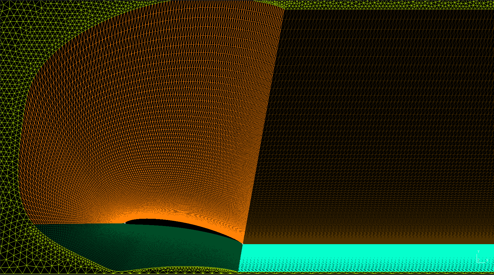
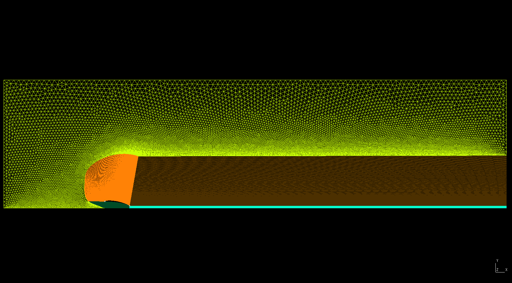
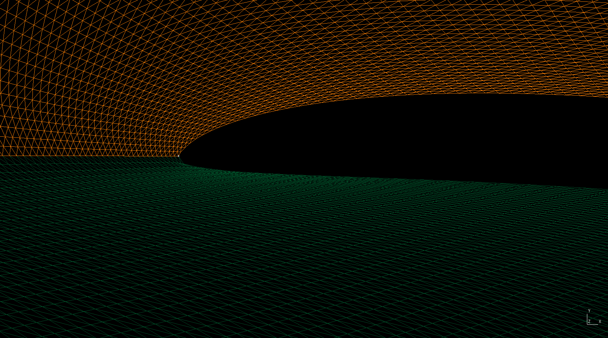

# CeGrid

**Python • Gmsh**

*A Gmsh-based parametric 2/3-D airfoil meshing pipeline that generates high-quality meshes consisting of a C-type structured boundary-layer region and an unstructured outer domain.*

<p align="center">
  
</p>

CeGrid was developed to automate the generation of high-quality airfoil meshes for CFD simulations, with particular emphasis on robust boundary-layer meshing around sharp trailing edges.

> **Current status:** The mesher is currently tuned for the **Eppler 61** airfoil. General support for arbitrary airfoils is planned but still under development.

---

## Usage

CeGrid is executed through the main `CeGrid` shell script, which handles the complete workflow:

1. Airfoil geometry processing
2. Boundary-layer curve generation
3. Gmsh geometry generation
4. Mesh generation

---

### Basic Usage

```bash
./CeGrid -f <airfoil_name>
```

Example:

```bash
./CeGrid \
    -f Eppler61 \
    -c 1.0 \
    -a 5 \
    -d 2D \
    -y 5e-5 \
    -t 0.02 \
    -n 20
```

> Note: The airfoil points in the `.dat` file should form a closed curve

---

### Available Options

| Option | Description | Default |
|--------|-------------|---------|
| `-f, --filename` | Airfoil points filename (without extension) | **Required** |
| `-c, --chord` | Airfoil chord length | `1.0` |
| `-a, --aoa` | Angle of attack (degrees) | `10` |
| `-s, --span` | Spanwise extrusion length (3D only) | `0.01` |
| `-l, --extrude-layers` | Number of spanwise extrusion layers | `1` |
| `-y, --first-layer` | First boundary-layer cell height | `1e-3` |
| `-t, --bl-thickness` | Total boundary-layer thickness | `0.1` |
| `-n, --num-bl-layers` | Number of boundary-layer layers | `100` |
| `-g, --ground` | Ground distance from trailing edge | `1` |
| `-d, --dim` | Mesh dimension (`2D`/`3D`) | `2D` |
| `-x, --filled` | Generate filled airfoil volume | Disabled |
| `-p, --plot` | Plot generated geometry | Disabled |
| `-q, --quads` | Recombine mesh into quadrilateral elements | Disabled |
| `-h, --help` | Display help | |

---

## Boundary Layer Detail

<p align="center">
  
</p>

---

## Requirements

### System Dependencies

- Python 3.x
- Gmsh 4.x
- `figlet` (used for terminal startup/ending banners)

On Ubuntu/Debian systems:

```bash
sudo apt install gmsh figlet
```

> Note: `figlet` is only used for terminal artwork and does not affect mesh generation. It can be removed from the shell scripts if running in a minimal environment.

### Python Dependencies

- NumPy
- SciPy
- Matplotlib (optional, only required for plotting)

```bash
pip install numpy scipy matplotlib
```

---

## Setup

Clone the repository:

```bash
git clone https://github.com/DwiaDwiaD/CeGrid.git
cd CeGrid
chmod +x CeGrid
```

---

## Workflow

Internally, **CeGrid** performs the following steps:

```
Airfoil (.dat, closed curve)
      |
      v
dat_to_geo.py
      |
      v
Airfoil_points (.geo)
      |
      v
Gmsh geometry (.geo)
      |
      v
meshEEW.sh
      |
      v
Final mesh (.msh)
```

The generated mesh is stored in the output mesh directory (`/meshesEEW`).

---

## Example Output

<p align="center">
  
</p>

A typical run generates:

- Processed airfoil geometry
- Boundary-layer offset curves
- C-grid farfield topology
- Gmsh mesh suitable for CFD simulations

---

## NOTES

- **Current status:** The mesher is currently tuned for the **Eppler 61** airfoil. General support for arbitrary airfoils is planned but still under development.
- The airfoil points in the `.dat` file should form a closed curve
- `figlet` is only used for terminal artwork and does not affect mesh generation. It can be removed from the shell scripts if running in a minimal environment.
- Make sure to check `Physical Groups` when making any changes in `MasterAirfoilEEW.geo`